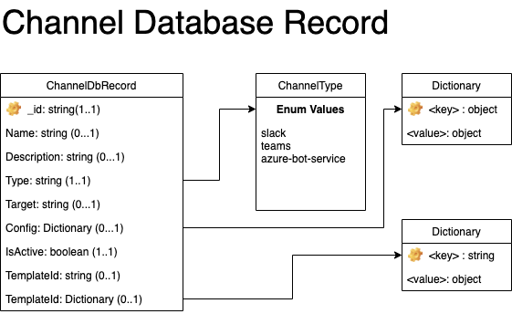

## Channel Database Record

The Channel Database Record represents a single channel that can be used by Syntinel that can receive Signal messages sent from Syntinel.

### Class Diagram


### JSON Schmea
````json
{
    "$schema": "http://json-schema.org/draft-04/schema#",
    "type": "object",
    "required": [ "_id" ],
    "properties": {
        "_id": { "type": "string" },
        "name": { "type": "string" },
        "description": { "type": "string" },
        "type": { "type": "string" },
        "target": { "type": "boolean" },
        "config": { "type": "object" },
        "isActive": { "type": "boolean"},
        "template": { "type": "string"},
        "arguments": { "type": "object" }
    }
}
````

### Field Descriptions

#### **ChannelDbRecord**
|Field|Type|Required|Description
|-----|----|--------|-----------
|_id|String|Yes|The unique identifier for this channel.
|name|String|No|The name of this channel (used for logging).
|description|String|No|A brief description of this channel (unused).
|type|[ChannelType](#channeltype)|Yes|The type of supported channel this represents.
|target|String|Maybe|The destination for the slack message within the specified channel (if required by the channel type).
|config|Json Object|Maybe|Channel-specific configuration (if required).
|isActive|Boolean|Yes|Indicates whether or not a channel is currently active.  
|template|String|Maybe|The unique identifier for the "Channel" template to use.
|arguments|Dictionary|Maybe|The values for the template parameters (key, value) to use when calling the template.


#### **ChannelType**
Enumeration of Supported Channel Types

- **slack** : Send to the Slack client via a channel endpoint.
- **teams** : Sent to the Microsoft Teams client via a channel endpoint.
- **azure-bot-service** : *Not Yet Implemented*

### Examples

#### **Sample Teams Channel Database Record**

The record below represents a fully defined Microsoft Teams endpoint that can receive messages from Syntinel.

````json
{
    "_id": "OpsTeamsChannel",
    "config": {
      "actionUrl": "https://xxxxxxxxxx.execute-api.us-east-2.amazonaws.com/syntinel/cue/teams"
    },
    "description": "The [syntinel] channel in the [MyOpsTeam] team.",
    "isActive": true,
    "name": "CHANNEL_NAME - TEAM_NAME",
    "target": "https://outlook.office.com/webhook/xxxxxxxx-xxxx-xxxx-xxxx-xxxxxxxxxxx@xxxxxxxxx-xxxx-xxxx-xxxx-xxxxxxxxxxxx/IncomingWebhook/xxxxxxxxxxxxxxxxxxxxxxxxxxxxxxxx/xxxxxxxx-xxxx-xxxx-xxxx-xxxxxxxxxxxx",
    "type": "teams"
}
````
#### **Sample Templated Teams Channel Database Record**

The database record below represents a templated Microsoft Teams channel.  Rather than providing the entire channel definition with configuration, the only thing that changes between each defined channel is the "endpoint url" (target), so we simply provide that to the template while config items like the actionUrl are defined in the template.

Channel Database Record
````json
{
  "_id": "OpsTeamChannel",
  "arguments": {
    "channelName": "Syntinel Alerts",
    "teamName": "Engineering Platform Onboarding",
    "target": "https://outlook.office.com/webhook/aaaaaaaa-aaaa-aaaa-aaaa-aaaaaaaaaaa@aaaaaaaaa-aaaa-aaaa-aaaa-aaaaaaaaaaaa/IncomingWebhook/aaaaaaaaaaaaaaaaaaaaaaaaaaaaaaaa/aaaaaaaa-aaaa-aaaa-aaaa-aaaaaaaaaaaa",
    "isActive": true
  },
  "template": "teams"
}
````

Template Database Record
````json
{
  "_id": "teams",
  "_type": "Channel",
  "parameters": {
    "channelName": [
      {
        "path": "description",
        "replace": "CHANNEL_NAME"
      },
      {
        "path": "name",
        "replace": "CHANNEL_NAME"
      }
    ],
    "isActive": [
      {
        "path": "isActive"
      }
    ],
    "target": [
      {
        "path": "target"
      }
    ],
    "teamName": [
      {
        "path": "description",
        "replace": "TEAM_NAME"
      },
      {
        "path": "name",
        "replace": "TEAM_NAME"
      }
    ]
  },
  "template": {
    "config": {
      "actionUrl": "https://xxxxxxxxxx.execute-api.us-east-2.amazonaws.com/syntinel/cue/teams"
    },
    "description": "The [CHANNEL_NAME] channel in the [TEAM_NAME] team.",
    "isActive": true,
    "name": "CHANNEL_NAME - TEAM_NAME",
    "target": "https://outlook.office.com/webhook/xxxxxxxx-xxxx-xxxx-xxxx-xxxxxxxxxxx@xxxxxxxxx-xxxx-xxxx-xxxx-xxxxxxxxxxxx/IncomingWebhook/xxxxxxxxxxxxxxxxxxxxxxxxxxxxxxxx/xxxxxxxx-xxxx-xxxx-xxxx-xxxxxxxxxxxx",
    "type": "teams"
  }
}
````
#### **Sample Slack Channel Database Record**

The record below represents a fully defined Slack endpoint that can receive messages from Syntinel.

````json
{	
	"_id": "OpsSlackChannel", 
    "description": "The #syntinel channel in the MySlackTeam team.",
    "isActive": true,
    "name": "#syntinel",
    "target": "https://hooks.slack.com/services/ABCDEFGHI/JKLMNOPQRST/UvWxyz1234567890abcdEfgh",
    "type": "slack"
}
````

#### **Sample Templated Slack Channel Database Record**

The database record below represents a templated slack channel.  Rather than providing the entire channel definition, the only thing that changes between each defined channel is the "endpoint url" (target), so we simply provide that to the template.

Channel Database Record
````json
{
  "_id": "OpsSlackChannel",
  "arguments": {
    "target": "https://hooks.slack.com/services/aaaaaaaaa/bbbbbbbbbbb/cccccccccccccccccccccccc",
    "isActive": true
  },
  "template": "slack"
}
````

Template Database Record
````json
{
  "_id": "slack",
  "_type": "Channel",
  "parameters": {
    "channelName": [
      {
        "path": "description",
        "replace": "CHANNEL_NAME"
      },
      {
        "path": "name",
        "replace": "CHANNEL_NAME"
      }
    ],
    "isActive": [
      {
        "path": "isActive"
      }
    ],
    "target": [
      {
        "path": "target"
      }
    ],
    "teamName": [
      {
        "path": "description",
        "replace": "TEAM_NAME"
      },
      {
        "path": "name",
        "replace": "TEAM_NAME"
      }
    ]
  },
  "template": {
    "description": "The CHANNEL_NAME channel in the TEAM_NAME team.",
    "isActive": true,
    "name": "CHANNEL_NAME - TEAM_NAME",
    "target": "https://hooks.slack.com/services/ABCDEFGHI/JKLMNOPQRST/UvWxyz1234567890abcdEfgh",
    "type": "slack"
  }
}
````
