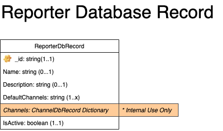

## Reporter Database Record

The Reporter Database Record contains information on the client that is "reporting" an event (Signal) to Syntinel.  It contains information on how the Signal message is to be routed as well as information about the reporter itself.

### Class Diagram


### JSON Schmea
````json
{
    "$schema": "http://json-schema.org/draft-04/schema#",
    "type": "object",
    "required": [ "_id" ],
    "properties": {
        "_id": { "type": "string" },
        "name": { "type": "string" },
        "description": { "type": "string" },
        "defaultChannels": { "type": "array", 
            "items": {"type": "string"} 
        },
        "isActive": { "type": "boolean" }
    }
}
````

### Field Descriptions

#### **ReporterDbRecord**
|Field|Type|Required|Description
|-----|----|--------|-----------
|_id|String|Yes|The unique identifier for the reporter.  This is the "reporterId" that will be provided by the inbound signal message.
|name|String|No|The name of this reporter (reference only).
|description|String|No|A brief description of this reporter (reference only).
|defaultChannels|List of String|No|The unique channel ids to send the signal message to by default.  These values can be overridden by the optional [Router](../../core/router.md) information provided in the signal message.
|isActive|Boolean|Yes|Flag to indicate whether or not this reporter is still active and allowed to send messages into Syntinel.


### Examples

#### **Sample Reporter Database Record**

This defines the default reporter used when no reporter is provided in the Signal message.  It sends the signal to 2 channels by default.

````json
{
  "_id": "_default",
  "defaultChannels": [
    "OpsTeamsChannel",
    "OpsSlackChannel"
  ],
  "description": "The default reporter for any signals with no reporter id specified.",
  "isActive": true,
  "name": "Default"
}
````
