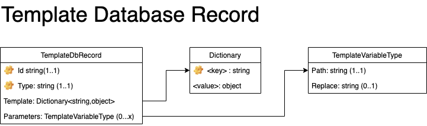

## Template Database Record

The Template Database Record stores all the various type of templates that can be used throughout Syntinel.  For more information on how Templates are used, see the [Templates](../../core/templates.md) page.

### Class Diagram


### JSON Schmea
````json
{
    "$schema": "http://json-schema.org/draft-04/schema#",
    "type": "object",
    "required": [ "_id", "_type" ],
    "properties": {
      "_id": { "type": "string" },
      "_type": { "type": "string", "pattern": "^CueOption|Channel$" },
      "template": { "type": "object" },
      "parameters" : { "type": "object",
        "additionalProperties": { "type": "array",
          "required": ["path"],
          "properties": {
            "path": { "type": "string" },
            "replace": { "type": "string" }
          }          
        }
      }

    }
}
````

### Field Descriptions

#### **Status**
|Field|Type|Required|Description
|-----|----|--------|-----------
|_id|String|Yes|The unique identifier (per type) for the template to ber used.
|_type|[TemplateType](../../core/templates.md#templatetypes)|Yes|The type of template this record represents.
|template|Json Object|Yes|The template itself.  See [Templates](../../core/templates.md) for description of each type and the proper Json format.
|parameters|List of [TemplateVariableType](#templatevariabletype)|No|List of parameters the can replace values within the template itself.

#### **TemplateVariableType**
|Field|Type|Required|Description
|-----|----|--------|-----------
|path|String|Yes|The J-Path to the part of the template to replace with the value passed. 
|replace|String|No|The sub-string at the J-Path location to replace (instead of replacing the entire value).

### Examples

#### **Sample CueOption Template Database Record**

A simple CueOption that will use the "Name" and "Description" field of a CueOption to send a simple alert.

````json
{
  "_id": "alert",
  "_type": "CueOption",
  "parameters": {
    "body": [
      {
        "path": "description"
      }
    ],
    "title": [
      {
        "path": "name"
      }
    ]
  },
  "template": {
    "description": "Message Body",
    "name": "Message Title"
  }
}
````

#### **Sample Channel Template Database Record**

A Microsoft Teams Channel template that contains the "reply to" url in the config section and allows the signal to override the target URL as well as other variables in the signal message.

````json
{
  "_id": "teams",
  "_type": "Channel",
  "parameters": {
    "channelName": [
      {
        "path": "description",
        "replace": "CHANNEL_NAME"
      },
      {
        "path": "name",
        "replace": "CHANNEL_NAME"
      }
    ],
    "isActive": [
      {
        "path": "isActive"
      }
    ],
    "target": [
      {
        "path": "target"
      }
    ],
    "teamName": [
      {
        "path": "description",
        "replace": "TEAM_NAME"
      },
      {
        "path": "name",
        "replace": "TEAM_NAME"
      }
    ]
  },
  "template": {
    "config": {
      "actionUrl": "https://xxxxxxxxxx.execute-api.us-east-2.amazonaws.com/syntinel/cue/teams"
    },
    "description": "The [CHANNEL_NAME] channel in the [TEAM_NAME] team.",
    "isActive": true,
    "name": "CHANNEL_NAME - TEAM_NAME",
    "target": "https://outlook.office.com/webhook/xxxxxxxx-xxxx-xxxx-xxxx-xxxxxxxxxxx0@xxxxxxxx-xxxx-xxxx-xxxx-xxxxxxxxxxxxx/IncomingWebhook/xxxxxxxxxxxxxxxxxxxxxxxxxxxxxxxx/xxxxxxx-xxxx-xxxx-xxxx-xxxxxxxxxxxx",
    "type": "teams"
  }
}
````