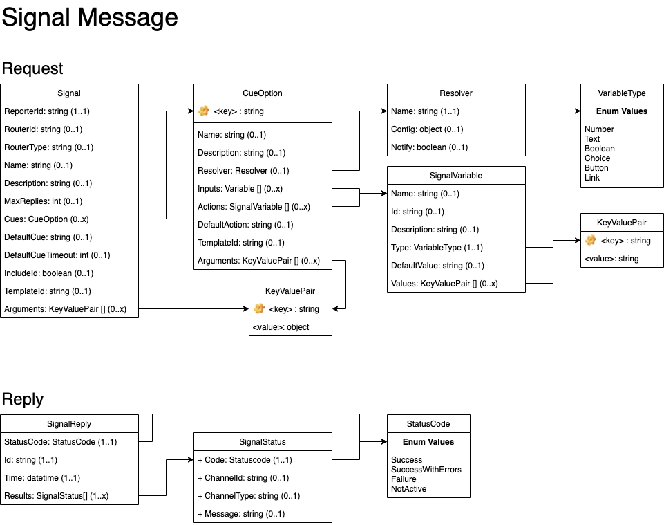
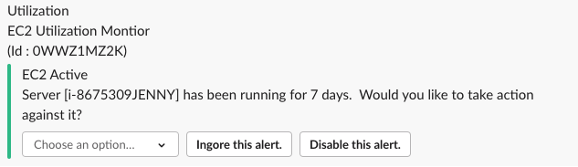

## Signal Messages

A Signal message is sent by reporters into Syntinel to generate an alert to one or more channels.

### Class Diagram


### JSON Schmea
````json
{
    "$schema": "http://json-schema.org/draft-04/schema#",
    "type": "object",
    "required": [ "reporterId" ],
    "properties": {
        "name": { "type": "string" },
        "description": { "type": "string" },
        "maxReplies": { "type": "integer" },
        "reporterId": { "type": "string" },
        "routerId": { "type": "string" },
        "routerType": { "type": "string" },
        "cues": {
            "type": "object",
            "additionalProperties": {
                "type": "object",
                "properties": {
                    "name": { "type": "string" },
                    "template": { "type": "string" },
                    "arguments": { "type": "object" },
                    "description": { "type": "string" },
                    "resolver": {
                        "type": "object",
                        "required": [ "name" ],
                        "properties": {
                            "name": { "type": "string" },
                            "config": { "type": "object"},
                            "notify": { "type": "boolean"}
                        }
                    },
                    "inputs": {
                        "type": "array",
                        "items": {
                            "type": "object",
                            "required": ["name", "type"],
                            "properties": {
                                "name": { "type": "string" },
                                "description": { "type": "string" },
                                "type": { "type": "string" , "pattern": "^number|text|boolean|choice|multichoice|button|link$"},
                                "defaultValue": { "type": "string" },
                                "values": { 
                                    "type": "array",
                                    "items": {
                                        "type": "object",
                                        "additionalProperties": {
                                            "type": "string"
                                        }
                                    }
                                }
                            }
                        }
                    },
                    "actions": {
                        "type": "array",
                        "items": {
                            "type": "object",
                            "required": ["id", "type"],
                            "properties": {
                                "name": { "type": "string" },
                                "id": { "type": "string" },
                                "description": { "type": "string" },
                                "type": { "type": "string" , "pattern": "^number|text|boolean|choice|multichoice|button|link$"},
                                "defaultValue": { "type": "string" },
                                "values": { 
                                    "type": "object",
                                    "additionalProperties": {
                                        "type": "string"
                                    }
                                }
                            }
                        }
                    },
                    "defaultAction": { "type": "string" }
                }
            }
        },
        "defaultCue": { "type": "string" },
        "defaultCueTimeout": { "type": "integer" },
        "includeId": { "type": "boolean" }
    }
}
````

### Field Descriptions

#### **Signal**
|Field|Type|Required|Description
|-----|----|--------|-----------
|reporterId|String|Yes|The unique Id registered with Syntinel for this reporter.  It helps determine message destination(s).
|routerId|String|No|Id to use when searching the custom routing table for alternative message destinations.
|routerType|String|Conditional|Required if RouterId provided.  The qualifier for what type of id was passed in.
|name|String|No|The name of the signal message.  Usually displayed in the "header" of the message.
|description|String|No|A description of the signal message.  Usually displayed in the "header" of the message.
|*maxReplies*|Integer|No|(Not Yet Implemented) The maximum number of valid replies allowed for this signal message.
|cues|Dictionary of [CueOption](#cueoption)|No|A list of possible replies to the signal message.  These are usually displayed in their own sections after the message "header".
|*defaultCue*|String|No|(Not Yet Implemented)The key value of the cue option to take by default.
|*defaultCueTimeout*|Integer|No|(Not Yet Implemented)The amount of time (in seconds) to wait before executing the defaultCue.
|includeId|Boolean|No|Flag to indicate whether the SignalId should be included in the display of the message.  *(Default Value = true)*

#### **CueOption**
|Field|Type|Required|Description
|-----|----|--------|-----------
|<key\>|String|Yes|A unique identifier for this instance of a cue option.  It is the key value of the dictionary object.
|name|String|No|A name to identify the particular cue option.  This value is usually displayed in the title of the message section for this cue.
|description|String|No|A description for this particular cue option.  This value is usually displayed in the title of the message section for this cue.
|resolver|[Resolver](#resolver)|No|The resolver to be called when action is taken on this Cue.
|*inputs*|List of [SignalVariable](#signalvariable)|No|(Not Yet Implemented)A list of items to display in the message which don't necessarily trigger an action, but provide additional input on the action taken.
|actions|List of [SignalVariable](#signalvariable)|No|A list of possible actions that can be taken on a Cue.
|*defaultAction*|String|No|(Not Yet Implemented)The default action to take when this cue is selected and no action has been specified.
|template|String|No|The [Template](../../core/templates.md) Id to be used for this Cue.  (TemplateType = CueOption)
|arguments|Dictionary of Objects|No|The arguments to be passed into the template for completing the Cue.

#### **Resolver**
|Field|Type|Required|Description
|-----|----|--------|-----------
|name|String|Yes|The name of the [resolver](../../resolvers/overview.md) to call.
|config|Object|No|Config parameters to be passed into the resolver.  This can be any valid JSON object, as long as it can be serialized.
|notify|Boolean|No|Flag to indicate that status notifications should be sent back to the original channels that received the Signal message. (**Default Value = false*)

#### **SignalVariable**
|Field|Type|Required|Description
|-----|----|--------|-----------
|name|String|No|The name for the input or action that is to be displayed.
|*id*|String|Yes|(Not Yet Implemented) A unique id for this action.  Will be used in conjunction with the "defaultAction" for this cue.
|description|String|No|A description for the input or action that is to be displayed.
|type|Choice of [VariableType](#variabletype)|Yes|The type of action or input object to display.
|defaultValue|String|Maybe|The default value for this action or input.  Depending on the "type" field, this may be a required value.
|values|Dictionary of String|Maybe|Possible values for the action or input.  Depending on the "type" field, this may be a required value.


#### **VariableType**
Enumeration of Variable Types

- *number* (Not Yet Implemented)
- *text* (Not Yet Implemented)
- *boolean* (Not Yet Implemented)
- choice
- *multichoice* (Not Yet Implemented)
- button
- *link* (Not Yet Implemented)

### Examples

#### **Sample Signal Message**

A sample ec2 utilization monitor that sends alerts when an instance has been up for more than 7 days, and allows the subscriber to take action against the ec2 instance directly from the Signal message.

The logic for actually interacting with the ec2 instance would be in the lambda function "my-lambda-function" resolver.

````json
{
  "name": "Utilization",
  "description": "EC2 Utilization Montior",
  "maxReplies": 1,
  "reporterId": "_default",
  "routerId": "MyId",
  "routerType": "MyIdType",
  "cues": {
    "ec2Usage": {
      "name": "EC2 Usage",
      "description": "Server [i-888888888888] has been running for 7 days.  Would you like to take action against it?",
      "resolver": {
        "name": "AWSLambda",
        "config": {
          "name": "my-lambda-function",
          "region": "us-east-1"
        }
      },
      "actions": [
        {
          "name": "Perform Action",
          "id": "action",
          "description": "Choose action to take against EC2 instances.",
          "type": "choice",
          "values": {
            "stop": "Stop Instance",
            "terminate": "Terminate Instance",
            "reboot": "Reboot Instance",
            "hibernate": "Stop and Hibernate Instance"
          },
          "defaultValue": "stop"
        },
        {
          "name": "Ignore Alert",
          "description": "Ignore this alert.",
          "type": "button",
          "defaultValue": "ignore"
        },
        {
          "name": "Disable Alert",
          "description": "Disable this alert.",
          "type": "button",
          "defaultValue": "disable"
        }
      ],
      "defaultAction": "Perform Action"
    }
  },
  "defaultCue": "ec2Usage",
  "defaultCueTimeout": 4320,
  "includeId": true
}
````

Result In Teams :


Result In Slack : 


#### **Sample Signal Using A Template**

Same as the signal above, but the majority of the signal message is being stored as a template, and only the relevant fields would need to be passed now (instance and notify).


Signal : 
````json
{
  "name": "Utilization",
  "description": "EC2 Utilization Montior",
  "maxReplies": 1,
  "reporterId": "_default",
  "includeId": true,
  "cues": {
    "ec2Usage": {
      "template": "ec2Usage",
      "arguments": {
        "instance": "i-8675309JENNY",
        "notify":  true
      }
    }
  },
  "defaultCue": "ec2Usage",
  "defaultCueTimeout": 4320
}
````

Template Record:
````json
{
  "_id": "ec2Usage",
  "_type": "CueOption",
  "parameters": {
    "instance": [
      {
        "path": "description",
        "replace": "INSTANCE_ID"
      },
      {
        "path": "resolver.config.instances[0]"
      }
    ],
    "notify": [
      {
        "path": "resolver.notify"
      }
    ]
  },
  "template": {
    "actions": [
      {
        "defaultValue": "stop",
        "description": "Indicates action to take against EC2 instances.",
        "name": "Choose Action",
        "type": "choice",
        "values": {
          "hibernate": "Stop and Hibernate Instance",
          "reboot": "Reboot Instance",
          "stop": "Stop Instance",
          "terminate": "Terminate Instance"
        }
      },
      {
        "defaultValue": "ignore",
        "description": "Ingore this alert.",
        "name": "Ignore Alert",
        "type": "button"
      },
      {
        "defaultValue": "disable",
        "description": "Disable this alert.",
        "name": "Disable Alert",
        "type": "button"
      }
    ],
    "defaultAction": "Ignore Alert",
    "description": "Server [INSTANCE_ID] has been running for 7 days.  Would you like to take action against it?",
    "name": "EC2 Active",
    "resolver": {
        "name": "AWSLambda",
        "config": {
            "name": "my-lambda-function",
            "region": "us-east-1"
        }
    }
  }
}
````

Result In Teams :


Result In Slack : 



#### **Simple Alert**

Sends a simple notification to the channels, displaying a main message and 2 "sub-messages".  There are no actions to be taken on this Signal message.

````json
{
  "name": "Main Name",
  "description": "Main Description",
  "reporterId": "_default",
  "cues": {
    "cue1": {
      "name": "Cue Name",
      "description": "Cue Description"
    },
    "cue2": {
      "name": "Cue2 Name",
      "description": "Cue2 Description"
    }
  }
}
````

Result In Teams :


Result In Slack : 


