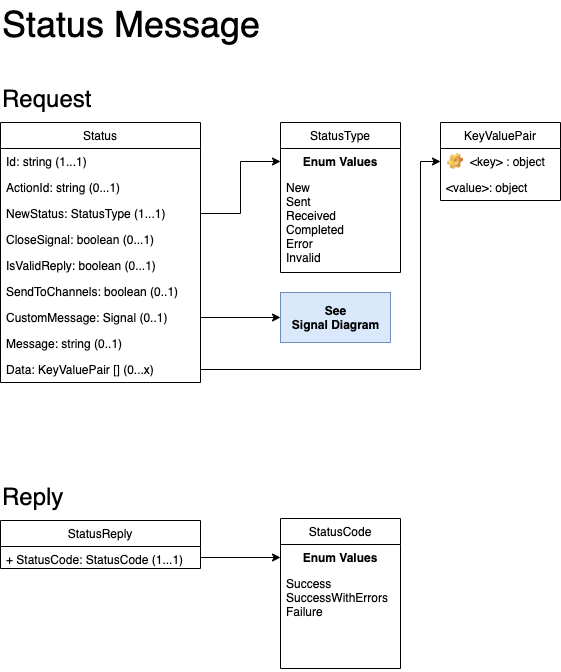

## Status Messages

A Status message is sent by resolvers to update Syntinel with the status of the requested actions.

### Class Diagram


### JSON Schmea
````json
{
    "$schema": "http://json-schema.org/draft-04/schema#",
    "type": "object",
    "required": [ "id" ],
    "properties": {
        "id": { "type": "string" },
        "actionId": { "type": "string" },
        "newStatus": { "type": "string" },
        "closeSignal": { "type": "boolean" },
        "isValidReply": { "type": "boolean" },
        "sendToChannels": { "type": "boolean" },
        "customMessage": { "type": "object"},
        "message": { "type": "string"},
        "data": { "type": "object" }
    }
}
````

### Field Descriptions

#### **Status**
|Field|Type|Required|Description
|-----|----|--------|-----------
|id|String|Yes|The Signal Id to which the status applies.
|actionId|String|Conditional|The Cue (Action) Id to which this status applies.  This is required for status updates from resolvers, as they are updating status on actions taken on a Signal.  For "signal level" status updates (ex: "Reporter Not Found"), this field is not required.
|newStatus|Choice of [StatusType](#statustype)|Yes|The type of status being updated.
|closeSignal|Boolean|No|Flag that marks the original signal as closed. (*Default Values = false*)
|isValidReply|Boolean|No|Flag that indicates the action requested on the Signal is a valid one and should count against the "Max Valid Replies" counter (Not Yet Implemented).  (*Default Value = true*)
|sendToChannels|Boolean|No|Flag that sends the status update to all the original channels the Signal as a new "notification" message.
|customMessage|[Signal](./signal-request.md)|No|A customized signal message that will be sent back to the original channels the Signal.  If no Signal message is provided here and the "sendToChannels" flag is true, the default message will be sent.
|message|String|No|A textual message of the Status update.
|data|Json Object|No|Any data that should be stored with the status message.

#### StatusType
Enumeration of Status Types

- **New** : The signal message has been received.
- **Sent** : The signal message has been sucessfully sent to at least one of the reporter's channels.
- **Received** : A reply (Cue) was received from one of the channels.
- **InProgress** : The reply (Cue) was sent to the resolver.
- **Completed** : The signal has been completed.
- **Error** : There was an error somewhere in the process.
- **Invalid** : The signal or cue message received was not valid.

**Note :** Resolvers should only send "Completed", "Error" or "Invalid" as the newStatus of a Status message.

### Examples

#### **Sample Status Message**

A sample status update message from a resolver that is responsible for update an ec2 instance state.

````json
{	
	"id": "0X3N9WBKR", 
	"actionId": "0X3NB1MZS", 
	"newStatus": "Error", 
	"closeSignal": true, 
	"isValidReply": true,
    "sendToChannels": true,
    "message": "The Server Is Already Terminated.",
    "data": {
        "instance": "i-8675309JENNY",
        "something": "else",
        "more": ["data", "can", "go", "here", "too"]
    }
}
````
