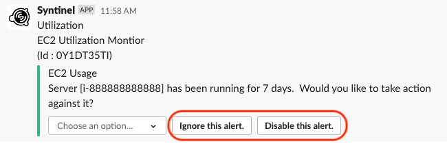
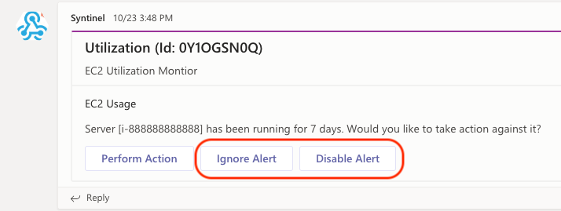
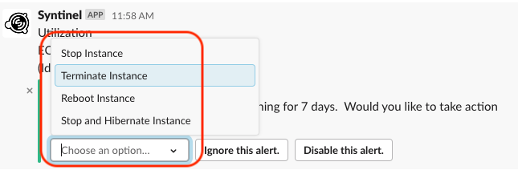
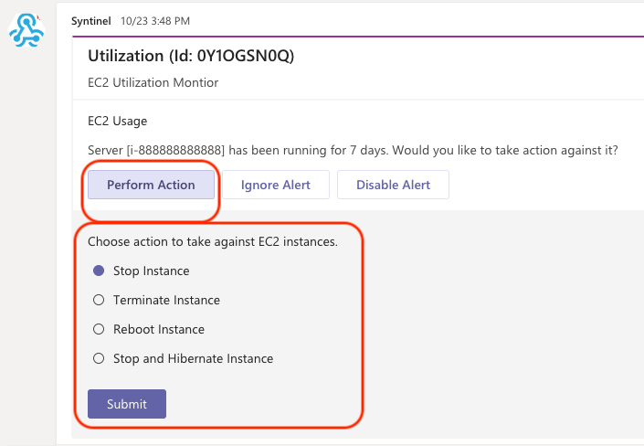

# Syntinel Actions

Each signal message sent to Syntinel can contain one or more "actions" that a subscriber can take in response to the event.  These usually appears as interactive elements within the channel message.  Not all action types are supported for every channel type.  Below is a table of all the actions and channels currently supported by Syntinel and whether the action is supported.

||[Button](#button)|[Choice](#choice)|
|-|-----|-----|
|Slack|Yes|Yes|
|Teams|Yes|Yes|

## Button

Button action types allow the subscriber to select a single, clickable button and "submit" that reply back to Syntinel for processing.

**Button Action In A Signal CueOption**
```json
{
    "name": "Ignore Alert",
    "description": "Ignore this alert.",
    "type": "button",
    "defaultValue": "ignore"
}
```

In the example action above, the value passed back when the button is selected is in the "defaultValue" field.   Below are examples of how the button action is displayed in each supported channel type.

### Slack


### Teams



## Choice

The Choice action type allows the subscriber to select from a list of options.  The selected option is then sent back to Syntinel for processing.

**Choice Action In A Signal CueOption**
```json
{
    "name": "Perform Action",
    "id": "action",
    "description": "Choose action to take against EC2 instances.",
    "type": "choice",
    "values": {
        "reboot": "Reboot Instance",
        "terminate": "Terminate Instance",
        "stop": "Stop Instance",
        "hibernate": "Stop and Hibernate Instance"
    },
    "defaultValue": "stop"
}
```

In the example action above, the value passed back when a choice is made is one of the values in the "values" field.   Below are examples of how the choice action is displayed in each supported channel type.

### Slack


### Teams


## Fields Passed To Resolver

Below is an example of the "actions" portion of the message sent to resolvers.  The selected action is passed back in the variable with the name "action", and the value associated with the action is returned as well.

```json
"actions": {
            "0Y1OJ52B0": {
                "cueId": "ec2",
                "variables": [
                    {
                        "name": "action",
                        "values": [
                            "ignore"
                        ]
                    }
                ],
                "isValid": true,
                "status": "Completed",
                "time": "2020-10-23T20:49:58.4296175Z"
            }
        },
```