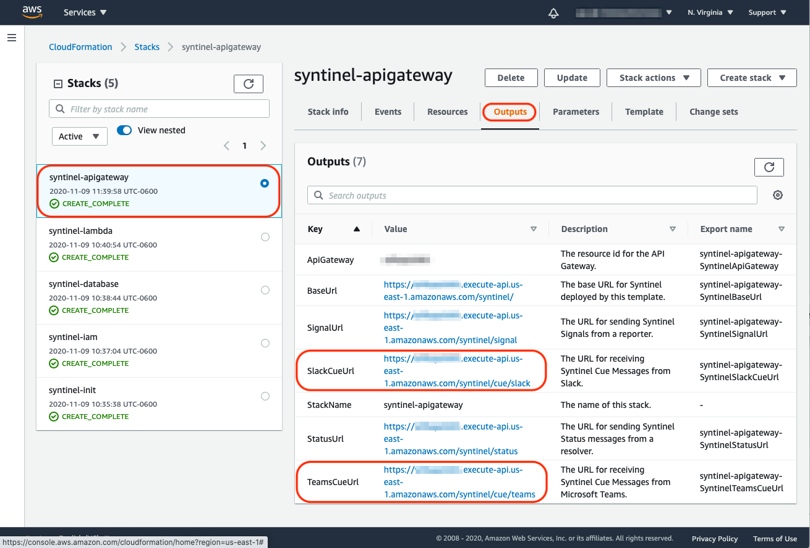

# Slack

Integration with Slack is performed using Incoming Webhooks for delivery of signal messages, and the Interactivity Request URL to specify where the reply to the signal message should be sent.

For more details, please visit the slack documention links below: 

- [Webhooks](https://api.slack.com/messaging/webhooks)
- [Interactivity](https://api.slack.com/messaging/interactivity)

## Setup Slack App

**Step 1** : Visit [https://api.slack.com](https://api.slack.com), login and select "Your Apps".


**Step 2** : Select "Create an App".


**Step 3** : Give the App a name and select which Slack workspace the app will appear in.


**Step 4** : Select "Incoming Webhooks" from the left-hand menu and then turn "Activate Incoming Webhooks" to "On".


**Step 5** : Select "Add New Webhook to Workspace".


**Step 6** : Select the channel this webhook will post messages into.


**Step 7** : Copy the Webhook URL.  This will be the "target" element for a slack [channel](../../classes/database/channel-db.md) or [template](../../classes/database/template-db.md) in Syntinel.


**Step 8** : Select "Interactivity & Shortcuts" from left-hand menu.  Turn "Interactivity" to "On" and then copy the [slack cue reply url](#getting-the-slack-cue-reply-url) into the Request URL field.


## Syntinel Channel Definition

Below is a sample Slack channel definition within Syntinel.  The Url you created for the Incoming Webhook should go into the "target" field.

The [Slack Cue Reply Url](#getting-the-slack-cue-reply-url) must be added into the Slack application itself (Step #8 above).

There is no "config" section needed for Slack channels.

```json
{
    "_id": "my-slack-channel",
    "type": "slack",
    "name": "My Slack Channel",
    "description": "Used for communication to My Team over Slack.",
    "isActive": true,
    "target": "https://hooks.slack.com/services/ABCDEFGHI/A00A0AA0AAA/xxxxxxxxxxxxxxxxxxxxxxxx",
    "config": {
    }
}
```


## Getting the Slack Cue Reply Url

The URL used by a Slack application to reply to Syntinel messages must be configured within the app itself.   Below are the different ways to find that Url value.

### CloudFormation Template Outputs

From the AWS Console, the URL can be found in the Outputs tab of the ApiGateway CloudFormation template.

- Log onto AWS Console.
- Select CloudFormation from the Services dropdown.
- Select the ApiGateway stack name (you may have to select "View Nested" if built from a single template.)
- Ensure the Api Gateway stack is selected under the stacks column.
- Select the "Outputs" tab.
- Copy the value for SlackCueUrl

**Note:** The name of the ApiGateway stack will be different if you gave it a custom name or deployed from a single CloudFormation template.




### Api Gateway Console

From the AWS Console, the url can be found in the API Gateway stages page for the Syntinel application.

- Log onto the AWS Console.
- Select API Gateway from the Services dropdown.
- Select the "syntinel" api.
- Select "Stages" from the left-hand menu, then expand the "syntinel" stage and selct the POST method for /cue/slack.
- Copy the "Invoke URL" field in the main menu.

**Note:** The names of the api and stage might be different if they were customized when deployed.


