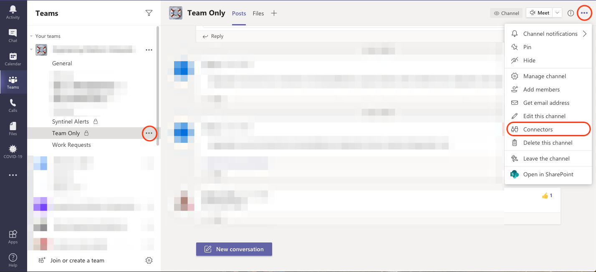
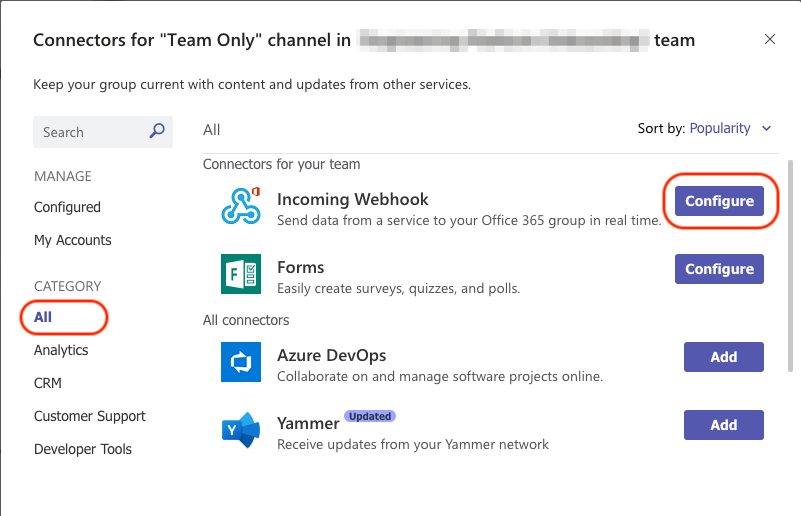
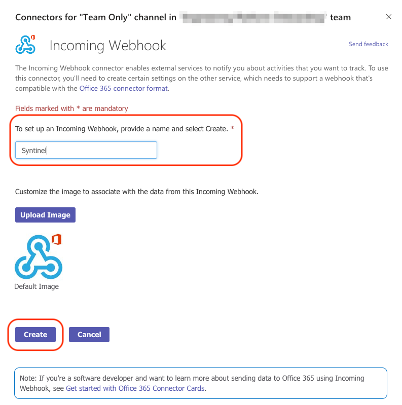
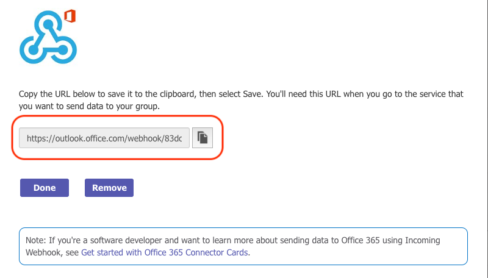
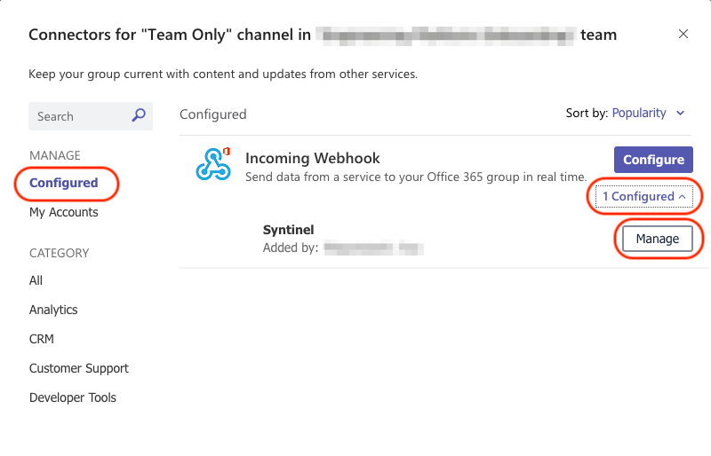
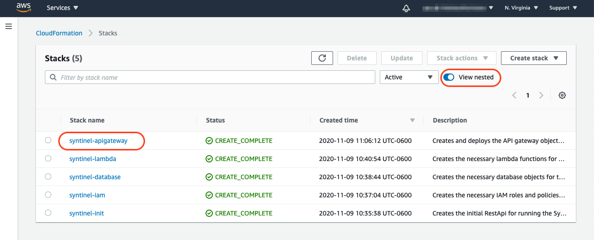
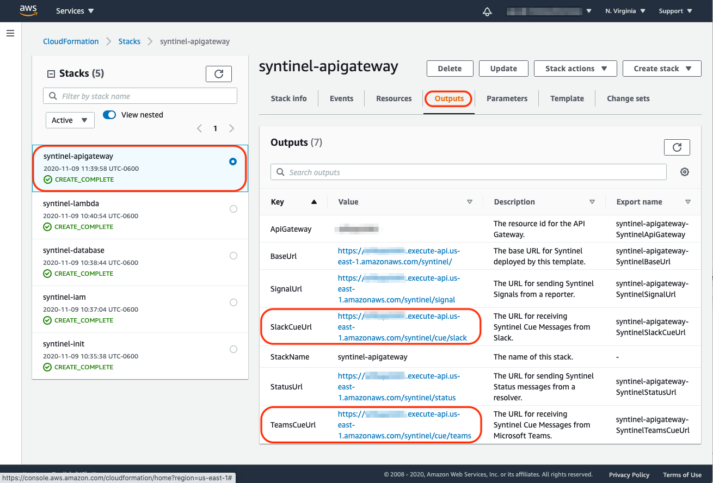
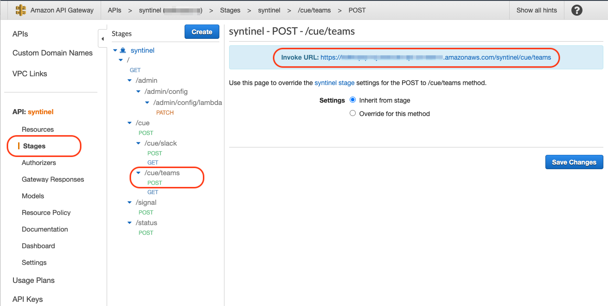

# Microsoft Teams

Integration with Microsoft Teams is performed by sending Legacy MessageCard objects (*Teams does not currently support AdaptiveCards*) to Incoming Webhooks for delivery of signal messages.  The url used by Teams to reply to actionable signal messages is configured in the config section of the [channel](../../classes/database/channel-db.md) or [template](../../classes/database/template-db.md) used by Syntinel.

For more details, please visit the Teams documention links below: 

- [MessageCard Reference (Legacy)](https://docs.microsoft.com/en-us/outlook/actionable-messages/message-card-reference)
- [MessageCard Playground](https://messagecardplayground.azurewebsites.net) (select "Legacy Message Card Samples" from downdown.)

## Setup Incoming Webhook in Teams Client

**Step 1** : Select the channel you wish to add the Syntinel alert to.  Choose the "More Options" menu item "..." and then select "Connectors" from the drop-down.


**Step 2** : With the "All" category selected, choose the "Configure" button on the "Incoming Webhook" connector.


**Step 3** : Name the webhook and select the "Create" button.


**Step 4** : Copy the URL created, as this will be needed for the Syntinel channel configuration, and select "Done".


**Step 5** : If you need to get the webhook URL at a later date, or need to remove the webhook, select "Configured" under the Manage section, find the Incoming Webhook connector, expand the "configured" dropdown and then select the "Manage" button.



## Syntinel Channel Definition

Below is a sample Teams channel definition within Syntinel.  The Url you created for the Incoming Webhook should go into the "target" field, while the [Teams Cue Reply Url](#getting-the-teams-cue-reply-url) should be added into the "config" section's "actionUrl" element.

```json
{
    "_id": "my-teams-channel",
    "type": "teams",
    "name": "My Teams Channel",
    "description": "Used for communication to My Team.",
    "isActive": true,
    "target": "https://outlook.office.com/webhook/xxxxxxxx-xxxx-xxxx-xxxx-xxxxxxxxxxx@xxxxxxxx-xxxx-xxxx-xxxx-xxxxxxxxxxxx/IncomingWebhook/xxxxxxxxxxxxxxxxxxxxxxxxxxxxxxxx/xxxxxxxx-xxxx-xxxx-xxxx-xxxxxxxxxxxx",
    "config": {
      "actionUrl": "https://xxxxxxxxxx.execute-api.us-east-2.amazonaws.com/syntinel/cue/teams"
    }
}
```

## Getting the Teams Cue Reply Url

The URL used by Microsoft Teams to reply to Syntinel messages is configured in the Syntinel Channel database and is part of the message sent to the subscriber.   Below are the different ways to find that Url value.

### CloudFormation Template Outputs

From the AWS Console, the URL can be found in the Outputs tab of the ApiGateway CloudFormation template.

- Log onto AWS Console.
- Select CloudFormation from the Services dropdown.
- Select the ApiGateway stack name (you may have to select "View Nested" if built from a single template.)
- Ensure the Api Gateway stack is selected under the stacks column.
- Select the "Outputs" tab.
- Copy the value for TeamsCueUrl

**Note:** The name of the ApiGateway stack will be different if you gave it a custom name or deployed from a single CloudFormation template.





### Api Gateway Console

From the AWS Console, the url can be found in the API Gateway stages page for the Syntinel application.

- Log onto the AWS Console.
- Select API Gateway from the Services dropdown.
- Select the "syntinel" api.
- Select "Stages" from the left-hand menu, then expand the "syntinel" stage and selct the POST method for /cue/teams.
- Copy the "Invoke URL" field in the main menu.

**Note:** The names of the api and stage might be different if they were customized when deployed.



