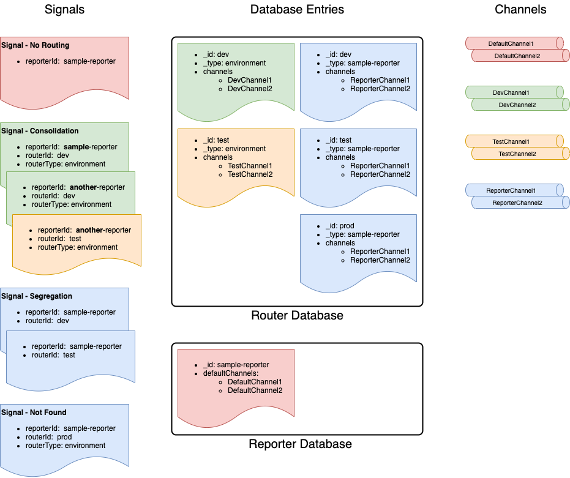

# Router

The Syntinel Router allows for reporters to send Signal messages to custom channels based on an id (and optional type) provided in the signal message.

For example, the default channels in the reporter database object can refer to the Production channels, but for testing purposes, the reporter can include a "routerId" and "routerType" fields in the Signal message.  If a record is found in the Router database matching those Id's it would route to DEV-specific channels instead.

**Signal Message**

```json
{
  "name": "Utilization",
  "description": "EC2 Utilization Montior",
  "maxReplies": 1,
  "reporterId": "my-reporter-id",
  "routerId": "dev",
  "routerType": "environment",
  "cues": {
    "ec2": {
      "template": "ec2-usage",
      "arguments": {
        "instance": "i-8675309JENNY",
        "notify": "true"
      }
    }
  }
}
```

## Routing Options

The router requires two values to search, an ID (routerId) and a TYPE (routerType).   When the routerType is not provided or a record is not found, the reporterId will be used as the TYPE to search on instead.  This allows for both scenarios below.

### Consolidation

In this scenario, the desire is to have ALL messages, no matter who is reporting them, to wind up in the same channel(s).  Using the signal above, the router entry below would accomplish this scenario.

**Router Database Entry**
```json
{
  "_id": "dev",
  "_type": "environment",
  "channels": [
    "my-consolidated-channel-slack",
    "my-consolidated-channel-teams"
  ]
}
```

### Segregation

Here, the desire is to have each reporter send to their own channel(s).   This can be accomplished by creating the router entry with the reporter id as the "_type" and by either :

- Having the reporter include the routerId, but not include a routerType.
- Ensure there is no router record that matches the provided id/type pair.

**Router Database Entries**
```json
{
  "_id": "dev",
  "_type": "my-reporter-id",
  "channels": [
    "my-segregrated-channel-slack",
    "my-segregrated-channel-teams"
  ]
}
```

```json
{
  "_id": "dev",
  "_type": "my-other-reporter-id",
  "channels": [
    "my-other-channel-slack",
    "my-other-channel-teams"
  ]
}
```

### Routing Examples



- **Signal - No Routing** : No routing information is provided, so message is routed to the defaultChannels in the Reporter record.
- **Signal - Consolidation** : Here, all reporters (*sample-reporter* and *another-reporter*) wind up in the same environment specific channels.
- **Signal - Segregation** : Because no routerType was passed in the signal message, the reporterId is used as the routerType.  
- **Signal - Not Found** : The routerId "prod" was not found with a matching routerType of "environment, however there was a "prod" found with the reporterId used as the type.  Thus it is send to the reporter specific channels.