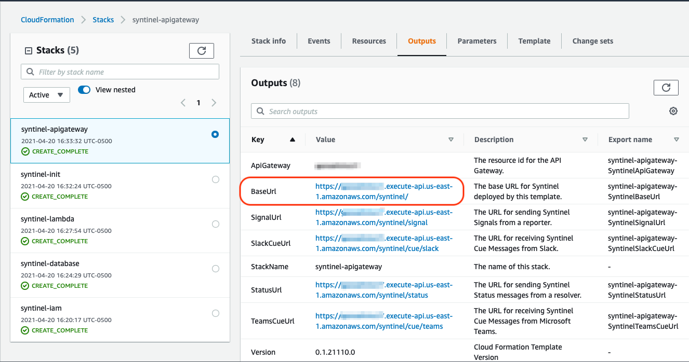

# Amazon Web Services

The Amazon Web Services (AWS) implementation of Syntinel utilizes a combination of API Gateway endpoints, Lambda functions (written in DotNet Core 3.1) and DynamoDB tables.

## Technical Architecture


## Installation

Syntinel can be installed into an AWS account by using one or many cloud formation templates included in the release zip file, located on [GitHub](https://github.com/SynapseProject/syntinel.core.net/releases).

The cloud formation template "cft-syntinel.yaml" creates all the necessary resources required to run Syntinel in your AWS account.  It calls the templates located in the "stacks" directory, passing the require variables into each template.  It assumes you are executing the template with a policy that has the required [permissions](#permissions) to create the resources.  The policy document can be found in the "policies" directory.

### Permissions

Below is a list of the minimum required permissions needed to install Syntinel : 

````yaml
- apigateway:
    - DELETE
    - GET
    - PATCH
    - POST
    - PUT
- cloudformation:
    - CreateStack
    - CreateStackInstances
    - DeleteStack
    - DeleteStackInstances
    - DescribeChangeSet
    - DescribeStackEvents
    - DescribeStacks
    - GetTemplate
    - GetTemplateSummary
    - ListStackInstances
    - ListStackResources
    - ListStacks
    - ListStackSetOperations
    - UpdateStack
    - UpdateStackInstances
    - ValidateTemplate
- dynamodb:
    - CreateTable
    - DeleteTable
    - DescribeTable
    - UpdateTable
- iam:
    - AttachRolePolicy
    - CreatePolicy
    - CreatePolicyVersion
    - CreateRole
    - DeletePolicy
    - DeletePolicyVersion
    - DeleteRole
    - DetachRolePolicy
    - GetPolicy
    - GetRole
    - ListAttachedRolePolicies
    - ListPolicies
    - ListPolicyVersions
    - ListRoles
    - PassRole
    - UpdateRole
- lambda:
    - AddPermission
    - CreateFunction
    - DeleteFunction
    - GetAccountSettings
    - GetFunction
    - GetFunctionConfiguration
    - ListFunctions
    - RemovePermission
    - UpdateFunctionCode
    - UpdateFunctionConfiguration
- s3:
    - GetObject
````

### Running Templates Separately

If you are unable (or unwilling) to execute the single template to deploy all parts of the Syntinel application (due to BoundryPolicies, or the permissions being spread across multiple roles) you can run each template in the "stacks" directory individually in the following order (with the approprite permissions for each): 

- cft-syntinel-init
- cft-syntinel-iam
- cft-syntinel-database
- cft-syntinel-lambda
- cft-syntinel-apigateway

### Template Variables

Most of the variables in the templates allow for customization when certain naming standards are required to be maintained.  The majority of the variables can be left as their default value with the following excpetions : 

- **S3BucketName :** The bucket name where these templates and the lambda source code zip file reside.  Must be in the same region as you intend to deploy Syntinel.
- **S3BucketPrefix :** If you have the Syntinel deployment artifacts in a sub-directory of a bucket, add that directory here.
- **PolicyPermissionBoundry :** If you are required to add a permission boundry on your IAM roles, include that value here.
- **xxxxxStackName :** If running each template separately, some of the templates require the stack name of the previously run templates.  

## DynamoDb

DynamoDb is a No-SQL database offering from Amazon Web Services.  Syntinel creates 5 tables within DynamoDb and stores the objects for each as a JSON document.

### Channels Table

- [Overview](../classes/database/channel-db.md)
- [Json Schema](../classes/database/channel-db.md#json-schmea)
- [Channel Types](../classes/database/channel-db.md#channeltype)
- [Examples](../classes/database/channel-db.md#examples)

### Reporters Table

- [Overview](../classes/database/reporter-db.md)
- [Json Schema](../classes/database/reporter-db.md#json-schmea)
- [Examples](../classes/database/reporter-db.md#examples)

### Router Table

- [Overview](../classes/database/router-db.md)
- [Json Schema](../classes/database/router-db.md#json-schmea)
- [Examples](../classes/database/router-db.md#examples)

### Signals Table

- [Overview](../classes/database/signal-db.md)
- [Json Schema](../classes/database/signal-db.md#json-schmea)
- [Examples](../classes/database/signal-db.md#examples)

### Templates Table

- [Overview](../classes/database/template-db.md)
- [Json Schema](../classes/database/template-db.md#json-schmea)
- [Examples](../classes/database/template-db.md#examples)

## Versions

To determine which version of Syntinel is running in any given Amazon account, version numbers are displayed in the various components of the Syntinel application.

### Cloud Formation Templates


Each cloud formation template includes a version variable in athe  output variable of the stack.  This will let you know which release version of the templates were used to install this Syntinel applicaiton.

### Lambda Function Code


Since the DotNet code which implements the lambda functions can be updated without redeploying or update the cloud formation templates, the version of the code is displayed in the CloudWatch logs for each and every lambda call.

## Admin Functions

API Gateway methods have been created to help administer the Syntinel instance.

### API Gateway Url



The main URL for making REST-based calls into Syntinel can be found in the output of the API Gateway Cloud Formation Stack, under the "BaseUrl" variable.


### Reload Lambda Functions

When the DotNet code behind the Syntinel functions needs to be updated, but the cloud formation templates have not been modified, execute the following REST call into Syntinel.

The returned JSON will describe each lambda method refreshed in detail.

#### Request
````
HTTP Verb:  PATCH
URL:        https://{{BaseUrl}}/admin/config/lambda
````

#### Response
````json
{
    "status": "Success",
    "body": {
        "syntinel-process-signal": {
            "ResponseMetadata": {
                "RequestId": "0c513981-3b82-43a6-913f-b25a57c9660f",
                "HTTPStatusCode": 200,
                "HTTPHeaders": {
                    "date": "Wed, 21 Apr 2021 19:16:57 GMT",
                    "content-type": "application/json",
                    "content-length": "1660",
                    "connection": "keep-alive",
                    "x-amzn-requestid": "0c513981-3b82-43a6-913f-b25a57c9660f"
                },
                "RetryAttempts": 0
            },
            "FunctionName": "syntinel-process-signal",
            "FunctionArn": "arn:aws:lambda:us-east-1:121808128646:function:syntinel-process-signal:34",
            "Runtime": "dotnetcore3.1",
            "Role": "arn:aws:iam::121808128646:role/syntinel-core-role",
            "Handler": "Syntinel.Aws::Syntinel.Aws.LambdaFunctions::ProcessSignal",
            "CodeSize": 1925992,
            "Description": "Processes incoming signal messages and forward them off to the appropriate signal publishers.",
            "Timeout": 300,
            "MemorySize": 128,
            "LastModified": "2021-04-21T19:16:57.361+0000",
            "CodeSha256": "y/T2gHu5m+FbdgvmbOJpYZaQBd8sBqtPCAZ766Up8Nk=",
            "Version": "34",
            "Environment": {
                "Variables": {
                    "Syntinel_ChannelPublisherPrefix": "syntinel-signal-publisher",
                    "Syntinel_SignalsTableName": "syntinel-signals",
                    "Syntinel_ProcessCueFunctionName": "syntinel-process-cue",
                    "Syntinel_ProcessStatusFunctionName": "syntinel-process-status",
                    "Syntinel_ReportersTableName": "syntinel-reporters",
                    "Syntinel_TemplatesTableName": "syntinel-templates",
                    "Syntinel_RouterTableName": "syntinel-router",
                    "Syntinel_DefaultReporterId": "_default",
                    "Syntinel_ChannelSubscriberPrefix": "syntinel-cue-subscriber",
                    "Syntinel_ChannelsTableName": "syntinel-channels",
                    "Syntinel_ProcessSignalFunctionName": "syntinel-process-signal"
                }
            },
            "TracingConfig": {
                "Mode": "PassThrough"
            },
            "RevisionId": "537226e9-9f16-4eea-841e-f53f3e7e1ab4",
            "State": "Active",
            "LastUpdateStatus": "Successful",
            "PackageType": "Zip"
        },
        /// CLIPPED ///
    }
}
````

### Export Database

When redeploying or moving a Syntinel instance to another region or account, it is useful to export the configuration data stored in the DynamoDB for import into the new (or redeployed) instance.  

This admin method exports the configuration tables (and optionally, the Signal history table) to an S3 bucket as a JSON file.

If no filename is provided in the request header, Syntinel will write the export to the S3 bucket where the lambda code and cloud formation templates were executed at installation.

#### Request
````
HTTP Verb:  POST
URL:        https://{{BaseUrl}}/admin/database/export
````

#### Request Body

````json
{
  "filename": "s3://mybucket/export.json",
  "include-signals": "false"
}
````

#### Response
````json
{
    "action": "Export",
    "filename": "s3://mybucket/export.json",
    "records": [
        {
            "type": "ReporterDbRecord",
            "count": 1
        },
        {
            "type": "ChannelDbRecord",
            "count": 4
        },
        {
            "type": "RouterDbRecord",
            "count": 4
        },
        {
            "type": "TemplateDbRecord",
            "count": 6
        }
    ]
}
````

### Import Database

After redeploying or moving a Syntinel instance to another region or account, you'll want to import the configuration data you exported earlier.  

This admin method imports the configuration tables (and optionally, the Signal history table) fron an S3 bucket JSON file into the DynamoDB tables.

If no filename is provided in the request header, Syntinel will look for the file in the S3 bucket where the lambda code and cloud formation templates were executed at installation.

#### Request
````
HTTP Verb:  POST
URL:        https://{{BaseUrl}}/admin/database/import
````

#### Request Body

````json
{
  "filename": "s3://mybucket/export.json",
  "include-signals": "false"
}
````

#### Response
````json
{
    "action": "Import",
    "filename": "s3://mybucket/export.json",
    "records": [
        {
            "type": "ReporterDbRecord",
            "count": 1
        },
        {
            "type": "ChannelDbRecord",
            "count": 4
        },
        {
            "type": "RouterDbRecord",
            "count": 4
        },
        {
            "type": "TemplateDbRecord",
            "count": 6
        }
    ]
}
````