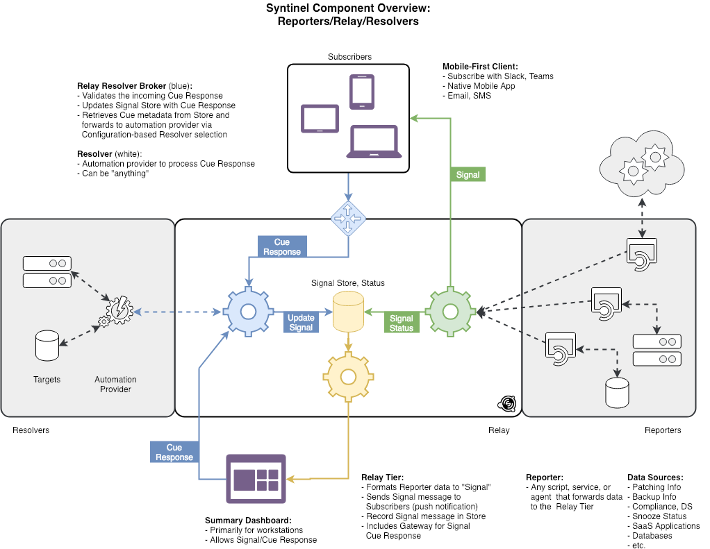

# Welcome to Syntinel

Syntinel is a notification engine that communicates messages to a variety of endpoints and can take actions based on replies to those messages.

## Glossary

**Reporters** - Any script, program, service, etc...  that is responsible for sending messages into Syntinel.

**Signal** - The message sent from Reporters into Syntinel.

**Channels** - The configuration item that specifes a single target for a Signal message.  Signals may send to more than one channel.

**Subscribers** - Client applications (Slack, Teams, Email, etc..) that receive Signals from Syntinel and display them to end clients for review or request actions to be taken.

**Cue** - A reply to a Signal, send from the Subscriber back into Syntinel.  This can contain information on which (if any) actions to take based on the Signal.

**Resolvers** - Appliations, programs or services that receive the Signal and Cue messages and take action based on those messages. (Ex: stop a service, restart a server, etc...)

**Relay Tier** - The Syntinel application itself.  Responsible for receiving, processing and forwarding Signals, Cues and Status updates.

**Signal Id** - A unique, 10-character string that identifies the original Signal message received.

**Action Id** - A unique, 10-character string that identifies an individual reply (Cue) to a Signal message from a subscriber.

## Components

| Component | Description |
| --------- | ----------- |
| Syntinel.Core | The core classes and interfaces that execute the relay tier of the Syntinel application. |
| Syntinel.Aws | A serverless implementation of Syntinel that runs on the Amazon Web Services platform.  It makes use of the API Gateway, DyanmoDB and Lambda AWS services to implement the application. |
| Syntinel.Tester | Used primarily for developer testing of the application. |

## Message Flow

The normal flow of messages through Syntinel is described below : 

| Step | Message Type | Description 
| ---- | ------------ | ----------- 
| 1 | Signal | Event received from a reporter for simple notification or a request for action. 
| 2 | Channel Message | The Signal message is transformed into channel specific messages and delivered to the subscribers for notification or action. 
| 3 | Subscriber Reply | For actionable messages, a channel-specific reply is sent back into Syntinel.
| 4 | Cue | Subscriber replies are converted to a common message format for processing by Syntinel.
| 5 | Resolver Request | Cues are processed and then passed on to the appropriate resolver for resolution.
| 6 | Status | Resolvers then submit Status updates back to Syntinel to update the original Signal message with the current status of the resolution.

