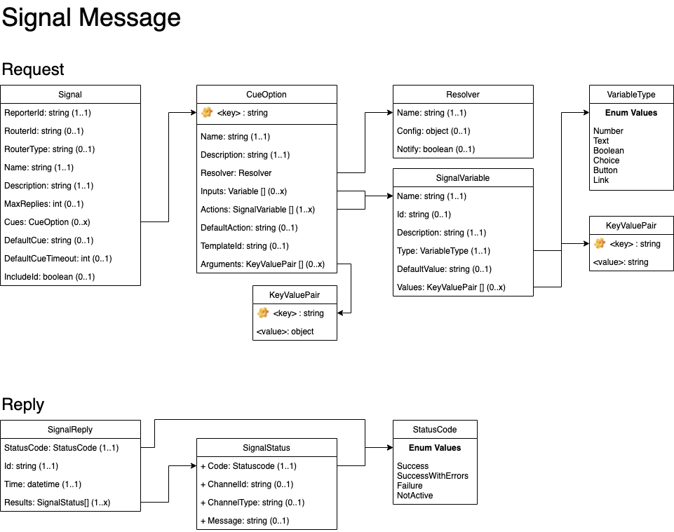

# Syntinel Inputs

## Signal Messages

A Signal message is sent by reporters into Syntinel to generate an alert to one or more channels.

### Class Diagram


### JSON Schmea
````json
{
    "$schema": "http://json-schema.org/draft-04/schema#",
    "type": "object",
    "required": [ "name", "description", "reporterId" ],
    "properties": {
        "name": { "type": "string" },
        "description": { "type": "string" },
        "maxReplies": { "type": "integer" },
        "reporterId": { "type": "string" },
        "routerId": { "type": "string" },
        "routerType": { "type": "string" },
        "cues": {
            "type": "object",
            "additionalProperties": {
                "type": "object",
                "properties": {
                    "name": { "type": "string" },
                    "template": { "type": "string" },
                    "arguments": { "type": "object" },
                    "description": { "type": "string" },
                    "resolver": {
                        "type": "object",
                        "required": [ "name" ],
                        "properties": {
                            "name": { "type": "string" },
                            "config": { "type": "object"},
                            "notify": { "type": "boolean"}
                        }
                    },
                    "inputs": {
                        "type": "array",
                        "items": {
                            "type": "object",
                            "required": ["name", "type"],
                            "properties": {
                                "name": { "type": "string" },
                                "description": { "type": "string" },
                                "type": { "type": "string" , "pattern": "^number|text|boolean|choice|multichoice|button|link$"},
                                "defaultValue": { "type": "string" },
                                "values": { 
                                    "type": "array",
                                    "items": {
                                        "type": "object",
                                        "additionalProperties": {
                                            "type": "string"
                                        }
                                    }
                                }
                            }
                        }
                    },
                    "actions": {
                        "type": "array",
                        "items": {
                            "type": "object",
                            "required": ["name", "type"],
                            "properties": {
                                "name": { "type": "string" },
                                "description": { "type": "string" },
                                "type": { "type": "string" , "pattern": "^number|text|boolean|choice|multichoice|button|link$"},
                                "defaultValue": { "type": "string" },
                                "values": { 
                                    "type": "object",
                                    "additionalProperties": {
                                        "type": "string"
                                    }
                                }
                            }
                        }
                    },
                    "defaultAction": { "type": "string" }
                }
            }
        },
        "defaultCue": { "type": "string" },
        "defaultCueTimeout": { "type": "integer" },
        "includeId": { "type": "boolean" }
    }
}
````

### Field Descriptions

**Signal**
|Field|Required|Description
|-----|--------|-----------

