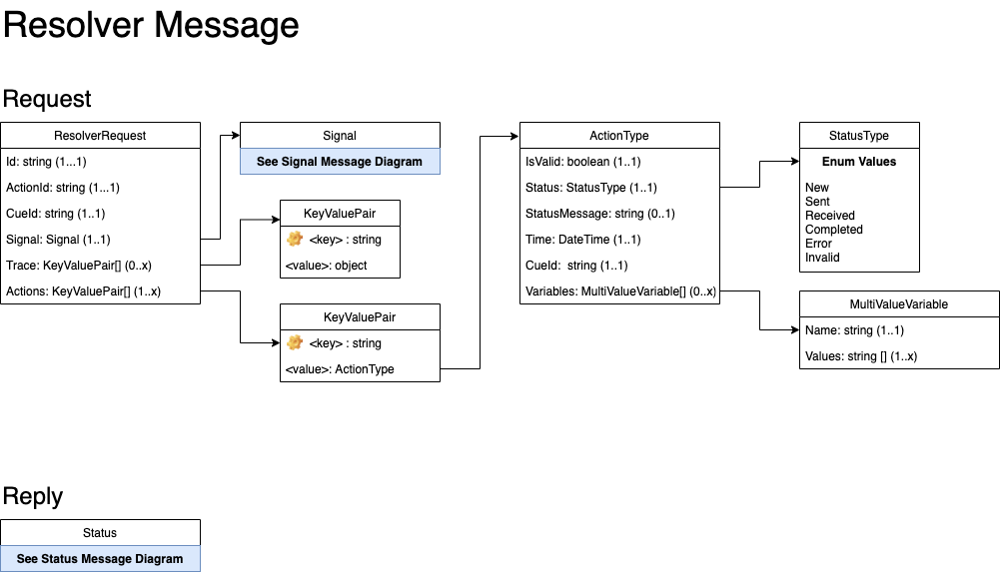

# Resolvers

Resolvers are classes that can are used to, well, resolve an action taken on a Signal message.  The clases themselves should not contain specific business logic, but rather encompass using a "technology" to solve the business problem.

An example would be the AWSLambda resolver.  It knows how to forward the action inputs and other data associated with it to an AWS Lambda function.  The logic to resolve the business requirements would be in that specific lambda function that is called.

## Resolver Types

|Name|Description
|----|-----------
|[Echo](./resolvers/echo.md)|Simply echos back the variables received in the Cue message.
|[AWSLambda](./resolvers/aws-lambda.md)|Calls an AWS Lambda function to resolve the Cue.
|*AWSStepFunction*|(Not Yet Implemented) Calls an AWS Step function to resolve the Cue.
|*AWSSystemManager*|(Not Yet Implemented) Executes a command on an EC2 instance using the AWS System Manager agent.
|*Rest*|(Not Yet Implemented) Sends the ResolverRequest to a REST Api via a POST request.


## Resolver Input

Each resolver receives the same information about the original Signal messages as well as the actions taken by the subscriber in regards to that message.  Unless it isn't supported by the resolver, the input will be in the JSON format (or a JSON Formated String).

### Class Diagram



### Json Schema

````json
{
  "$schema": "http://json-schema.org/draft-04/schema#",
  "type": "object",
  "required": [ "id", "actionId", "cueId", "signal", "actions" ],
  "properties": {
    "id": { "type": "string" },
    "actionId": { "type": "string" },
    "cueId": { "type": "string" },
    "signal": {
    	*** Add Signal Json Schema Here ***
    },
    "actions": {
      "type": "object",
      "additionalProperties": {
        "type": "object",
        "required": [ "cueId", "variables", "time" ],
        "properties": { 
          "cueId": { "type": "string"},
          "variables": { "type": "array",
          "items": [
            {
              "type": "object",
              "properties": {
                "name": { "type": "string" },
                "values": { "type": "array",
                  "items": [ { "type": "string" } ]
                }
              }
            }
          ]
        },
          "isValid": { "type": "boolean" },
          "status": { "type": "string" },
          "time": { "type": "string" }
        }
      }
    },
    "trace": {
      "type": "object"
    }
  }
}
````

### Field Descriptions

#### **ResolverRequest**
|Field|Type|Required|Description
|-----|----|--------|-----------
|id|String|Yes|The Id field of the Signal message.
|actionId|String|Yes|The ActionId field of the reply sent from the subscribers.
|cueId|String|Yes|The name of the CueOption in the Signal message that was selected by the subscriber on which the action was taken.
|signal|Signal|Yes|The original signal message sent to the subscribers.
|actions|Dictionary of [ActionType](#actiontype)|Yes|A dictionary of all actions taken against this signal (including the current action).
|trace|Dictionary of Object (JSON)|No|A log of events that have occured for this signal message.

#### **ActionType**
|Field|Type|Required|Description
|-----|----|--------|-----------
|cueId|String|The CueOption that was selected for this action.
|variables|List of [MultiValueVariable](#multivaluevariable)|List of variables returned for this action.
|isValid|Boolean|Yes|Flag to say if action was/is valid.
|status|[StatusType](classes/status-request.md#statustype)|Yes|Tells the current status of the action.
|statusMessage|String|No|Message that describes the reason of the stauts.
|time|DateTime|Yes|The time the action was taken.


#### **MultiValueVariable**
|Field|Type|Required|Description
|-----|----|--------|-----------
|name|String|Yes|The variable name.
|values|List of String|No|The value or values selected for the variable.

### Examples

````json
{
    "id": "0X7ZKIFE4",
    "actionId": "0X7ZN7XYF",
    "cueId": "ec2",
    "signal": {
        "reporterId": "_default",
        "routerId": "MyId",
        "routerType": "MyIdType",
        "name": "Utilization",
        "description": "EC2 Utilization Montior",
        "maxReplies": 1,
        "cues": {
            "ec2": {
                "name": "EC2 Usage",
                "description": "Server [i-888888888888] has been running for 7 days.  Would you like to take action against it?",
                "resolver": {
                    "name": "AWSLambda",
                    "notify": true,
                    "config": {
                        "name": "echo"
                    }
                },
                "inputs": [],
                "actions": [
                    {
                        "name": "Perform Action",
                        "id": "action",
                        "description": "Choose action to take against EC2 instances.",
                        "type": "choice",
                        "values": {
                            "reboot": "Reboot Instance",
                            "terminate": "Terminate Instance",
                            "stop": "Stop Instance",
                            "hibernate": "Stop and Hibernate Instance"
                        },
                        "defaultValue": "stop"
                    },
                    {
                        "name": "Ignore Alert",
                        "id": null,
                        "description": "Ignore this alert.",
                        "type": "button",
                        "values": null,
                        "defaultValue": "ignore"
                    },
                    {
                        "name": "Disable Alert",
                        "id": null,
                        "description": "Disable this alert.",
                        "type": "button",
                        "values": null,
                        "defaultValue": "disable"
                    }
                ],
                "defaultAction": "Perform Action",
                "template": null,
                "arguments": null
            }
        },
        "defaultCue": null,
        "defaultCueTimeout": 0,
        "includeId": true
    },
    "actions": {
        "0X7ZN7XYF": {
            "cueId": "ec2",
            "variables": [
                {
                    "name": "action",
                    "values": [
                        "reboot"
                    ]
                }
            ],
            "isValid": true,
            "status": "New",
            "time": "2020-10-07T20:02:09.0104309Z"
        }
    },
    "trace": {
        "0X7ZKJZQ9_SignalReply": {
            "id": "0X7ZKIFE4",
            "time": "2020-10-07T20:00:10.609855Z",
            "results": [
                {
                    "channelType": "teams",
                    "code": "Success",
                    "message": "Success",
                    "channelId": "_defaultTeams"
                },
                {
                    "channelType": "slack",
                    "code": "Success",
                    "message": "Success",
                    "channelId": "_default"
                }
            ],
            "statusCode": "Success"
        }
    }
}
````